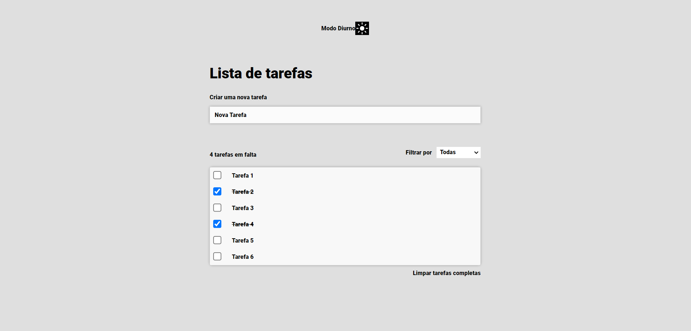

# Todo app solution

## Table of contents

- [Overview](#overview)
  - [The challenge](#the-challenge)
  - [Screenshot](#screenshot)
- [My process](#my-process)
  - [Built with](#built-with)

## Overview

### The challenge

Users should be able to:

- :x: View the optimal layout for the app depending on their device's screen size
- :white_check_mark: See hover states for all interactive elements on the page
- :white_check_mark: Add new todos to the list
- :white_check_mark: Mark todos as complete
- :white_check_mark: Delete todos from the list
- :white_check_mark: Filter by all/active/complete todos
- :white_check_mark: Clear all completed todos
- :x: Toggle light and dark mode
- :x: **Bonus**: Drag and drop to reorder items on the list
- :white_check_mark: **Bonus**: The todos data should be stored through refreshes.

### Screenshot

## My process

As a first aproach to this challange my ideia was to create a TodoWraper component where i could handle most of the logic for this task.
I started by creating the more basic objectives like Create new tasks, mark them as completed and delete them followed by Filter and Clear list part.
Implementing data storage through refreshes was really simple compared to changing themes, which was something i did not plan accordingly while doing the tasks.
Obviously there are parts that can be improved like separate the css, method refactors, finishing objectives like layout scalability but overall was a great challange for someone less experienced with Frontend Technologies and without the use of some commons third party libs.

### Built with

- Semantic HTML5 markup
- CSS custom properties
- [React](https://reactjs.org/) - JS library

